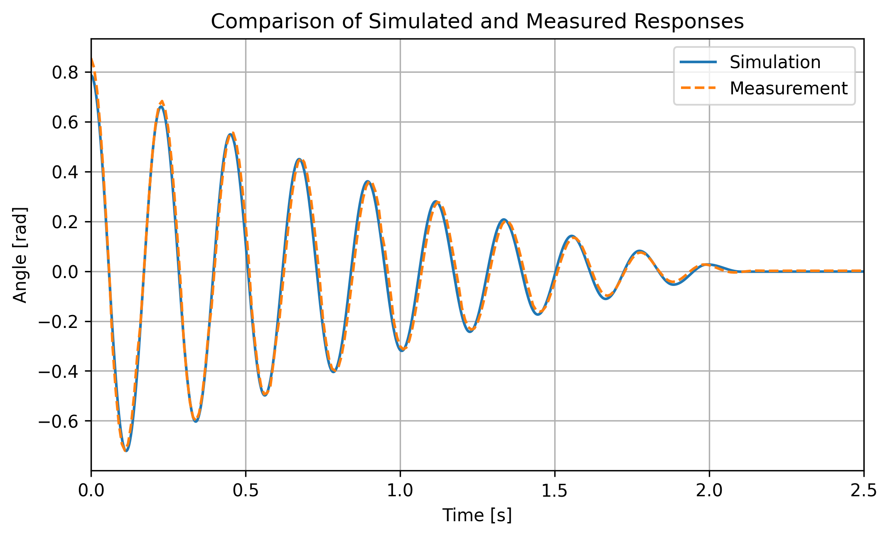

# FLYArm-1D

## Pendulum acting as a 1-DOF drone simulator

Embedded control system - custom 3D printed pendulum acting as 1-DOF drone simulator enabling stabilization at a desired angle. Simplified simulator of drone dynamics with one degree of freedom. 

The goal is to stabilize the pendulum at a desired angle using BLDC motor with a proppeler as actuator and feedback from MPU6050 IMU. 

The project combines embedded programming, control theory, sensor fusion and mechanical design.

## System Architecture
- MCU: STM32 Nucleo L476RG
- Actuator: BLDC motor with proppeler mounted at the end of the pendulum, driven by BlHeli_S ESC
- Feedback: MPU6050 IMU using complementary filter to combine gyro and accelerometer data
- Control algorithms: PID, LQR
- Power Supply: Li-ion 18650 2S high current pack

## Mechanical Design
- Custom pendulum structure designed and 3D printed
- Only not 3D printed part - metal bearings
- Designed in Autodesk Fusion
- 3D printed with PLA on Prusa i3MK3S+

## Digital Twin
A digital twin of the system was developed for LQR regulator design.
Model was implemented in Python and validated by comparing simulated responses with measurments from the real system.

